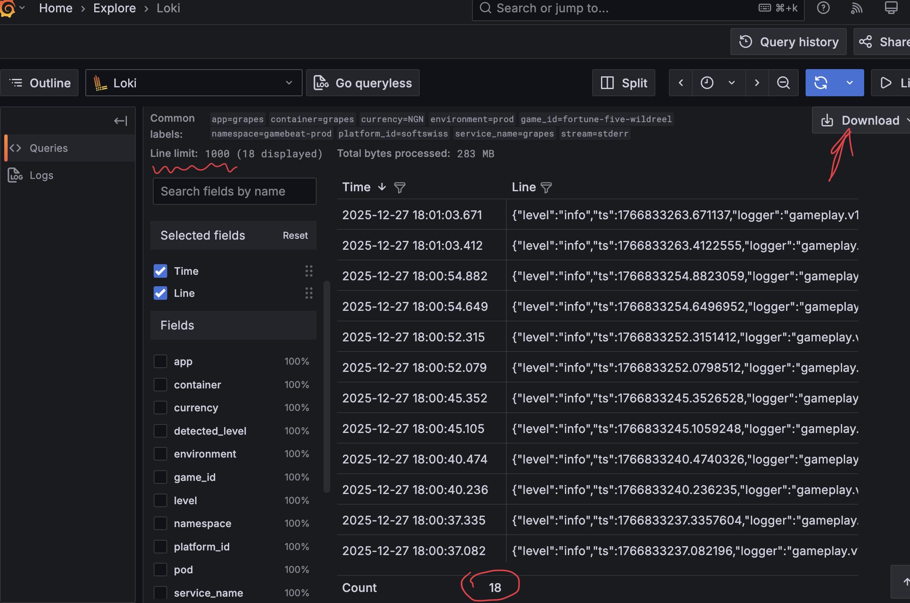

# 🎮 Gaming Logs Fraud Detector

A comprehensive analysis tool for gaming transaction logs that detects suspicious activity, generates detailed reports, and ensures data integrity through duplicate detection.

## 📋 Table of Contents

- [Features](#-features)
- [Installation](#-installation)
- [Usage](#-usage)
- [Important Locki Limitations](#-important-locki-limitations)
- [File Structure](#-file-structure)
- [Report Sections](#-report-sections)
- [Fraud Detection](#-fraud-detection)
- [Examples](#-examples)
- [Troubleshooting](#-troubleshooting)

## ✨ Features

- **Multi-file Analysis**: Process multiple JSON log files simultaneously
- **Duplicate Detection**: Automatically identifies and skips duplicate bets and wins using `betID` and `winID`
- **Fraud Detection**: Identifies suspicious patterns like abnormally high RTP (Return to Player)
- **Comprehensive Reports**: Detailed analysis including:
  - General statistics and time span analysis
  - Player performance metrics with profit/loss calculations
  - Game statistics and RTP analysis
  - Hourly activity breakdown
  - Top bets and wins tracking
- **Data Integrity**: Validates transaction uniqueness and reports any inconsistencies
- **Multi-currency Support**: Currently optimized for NGN (Nigerian Naira)

## 🚀 Installation

### Prerequisites

- Go 1.19 or later installed on your system
- Gaming log files in JSON format

### Setup

1. Clone or download this repository
2. Navigate to the project directory
```bash
cd fraud-detector
```

3. Verify Go installation
```bash
go version
```

## 📖 Usage

### Basic Usage

1. **Place your JSON log files** in the same directory as the `main.go` file
   - Files should be named descriptively (e.g., `25.12.2025.json`, `26.12.2025-morning.json`)
   - The tool automatically detects all `*.json` files in the directory

2. **Run the analysis**
```bash
go run main.go
```

3. **View the results** in your terminal - the tool will display:
   - File loading progress
   - Data integrity checks
   - Comprehensive analysis report

### Advanced Usage

**Compile for better performance:**
```bash
go build -o fraud-detector main.go
./fraud-detector
```

## ⚠️ Important Loki Limitations

### Critical Download Restrictions

**🔴 1000 Log Limit**: Loki system has a strict limitation of **1000 logs per download**. This is crucial to understand when extracting gaming logs.




### Recommended Strategy

#### For Large Time Ranges:

❌ **Don't do this:**
```
Download: 2025-12-01 to 2025-12-31 (full month)
Result: Only first/last 1000 logs - INCOMPLETE DATA
```


✅ **Do this instead:**
```
Download 1: 2025-12-25 22:00 to 2025-12-25 23:59 → saves as 25.12.2025.json
Download 2: 2025-12-26 00:00 to 2025-12-26 11:59 → saves as 26.12.2025-morning.json  
Download 3: 2025-12-26 12:00 to 2025-12-26 23:59 → saves as 26.12.2025-evening.json
Download 4: 2025-12-27 00:00 to 2025-12-27 23:59 → saves as 27.12.2025.json
```

#### Best Practices:

1. **Monitor log count** during Locki export
2. **If approaching 1000 logs** - reduce time range
3. **Split busy periods** (peak hours) into smaller chunks
4. **Verify completeness** - check if logs end abruptly
5. **Use descriptive filenames** for easier tracking

#### Time Range Recommendations:

- **Low activity periods**: 6-12 hours per file
- **Medium activity**: 3-6 hours per file  
- **High activity periods**: 1-3 hours per file
- **Peak gaming hours**: 30 minutes - 2 hours per file

## 📁 File Structure

### Expected JSON Format

Each log file should contain an array of log entries:

```json
[
  {
    "line": "{\"level\":\"info\",\"ts\":1766833263.671137,\"msg\":\"SendBet\",\"player_id\":\"1000999711406\",\"bet\":100000,\"bet_id\":\"unique-bet-123\",\"balance\":950000}",
    "timestamp": "2025-12-25T22:57:43.671Z",
    "fields": {}
  }
]
```

### Key Fields in Log Data:

- **`bet_id`**: Unique identifier for bets (used for duplicate detection)
- **`win_id`**: Unique identifier for wins (used for duplicate detection)  
- **`player_id`**: Player identifier for statistics grouping
- **`game_id`**: Game identifier for game-specific analysis
- **`bet`**: Bet amount in minor currency units (e.g., kobo for NGN)
- **`win`**: Win amount in minor currency units
- **`balance`**: Player balance after transaction
- **`ts`**: Unix timestamp for temporal analysis

## 📊 Report Sections

### 1. General Statistics
- Analysis time period and duration
- Total bets and wins count
- Total bet and win amounts
- Net result and overall RTP
- Unique players and games count

### 2. Player Analysis
- Individual player performance metrics
- Profit/loss calculations in currency and percentages  
- RTP analysis per player
- Top bets and biggest wins tracking
- Current balance information

### 3. Game Statistics
- Game-specific performance metrics
- RTP per game
- Player count per game
- Volume analysis

### 4. Temporal Analysis
- Hourly activity breakdown
- Peak gaming hours identification
- Activity distribution patterns

### 5. Fraud Detection
- High RTP warnings (>150% with >100 bets)
- Unusual betting patterns
- Data integrity status

## 🔍 Fraud Detection

### Automatic Detection Triggers:

1. **High RTP Alert**: Players with >150% RTP and >100 bets
2. **Duplicate Transactions**: Automatically detected and reported
3. **Data Integrity Issues**: Missing or malformed data

### Fraud Indicators:

- Suspiciously high win rates
- Unusual betting patterns
- Duplicate transaction attempts
- Abnormal balance changes

## 💡 Examples

### Example Output:

```
📁 Found 3 JSON files to analyze:
   1. 25.12.2025.json
   2. 26.12.2025-morning.json  
   3. 26.12.2025-evening.json

📖 Reading 25.12.2025.json...
   ✅ Loaded 352 entries from 25.12.2025.json

✅ DATA INTEGRITY: No duplicate transactions detected

============================================================
                    GAMING LOGS ANALYSIS REPORT
============================================================

📊 GENERAL STATISTICS:
├─ Analysis Period: 2025-12-25 22:57:47 - 2025-12-26 18:01:03
├─ Total Bets: 1,247  
├─ Total Wins: 186
├─ Total Bet Amount: 87,450,000 NGN
├─ Total Win Amount: 45,220,000 NGN
├─ Net Result: -42,230,000 NGN
├─ RTP (Return to Player): 51.71%
├─ Unique Players: 5
└─ Unique Games: 2

👥 PLAYER ANALYSIS (5 unique players):
Player #1: 1000999711406
├─ 📊 Activity: 894 bets, 123 wins
├─ 💰 Volume: Bet 67,890,000 NGN, Win 34,560,000 NGN  
├─ 📉 Net Profit: -33,330,000 NGN (-49.09%)
├─ 🎯 RTP: 50.91%, Current Balance: 2,450,000 NGN
├─ 🎲 Largest Bets: 2,000,000 NGN, 1,500,000 NGN, 1,200,000 NGN
└─ 🏆 Biggest Wins: 15,000,000 NGN, 8,500,000 NGN, 6,200,000 NGN
```

### Common Use Cases:

1. **Daily Analysis**: Process single day logs for daily reports
2. **Multi-day Analysis**: Combine multiple days for trend analysis  
3. **Fraud Investigation**: Focus on suspicious patterns and high RTP players
4. **Performance Monitoring**: Track game RTP and player behavior
5. **Data Validation**: Ensure log completeness and detect duplicates

## 🔧 Troubleshooting

### Common Issues:

**File Not Found:**
```bash
Error: no JSON files found in current directory
```
*Solution*: Ensure your JSON files are in the same directory as main.go

**Invalid JSON Format:**
```bash  
Error: unmarshaling: invalid character...
```
*Solution*: Verify your JSON files are properly formatted and exported from Locki correctly

**Incomplete Data:**
```bash
Found 1000 entries - possible incomplete data
```
*Solution*: Check if you hit Locki's 1000-log limit. Re-export with smaller time ranges.

**Memory Issues:**
```bash
Out of memory error
```  
*Solution*: Process smaller batches of files or increase available system memory

### Performance Tips:

1. **Process files in batches** for very large datasets
2. **Use compiled binary** (`go build`) for better performance
3. **Monitor system resources** during analysis
4. **Split large time periods** to avoid memory issues

---

## 📄 License

This tool is designed for internal use in gaming log analysis and fraud detection.

## 🤝 Support

For technical issues or feature requests, please contact the development team.

---
*Made with ❤️ for gaming security and integrity*
